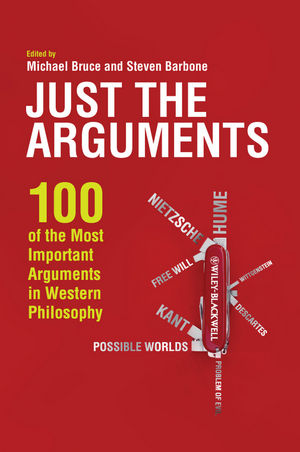

# 每日哲论 Daily Arguments

###### Edit by [Hao ZHAN](https://github.com/zhanhao93)

### 1.关于

每日哲论是「三艺四术」平台的一个全新的计划。

我们尝试基于 *Just the Arguments: 100 of the Most Important Arguments in Western Philosophy* 一书的内容，每天翻译书中的一例 *Arguments* 。

为了减少工作量，我们将翻译的内容可能限制在具体推导过程上（即P1到Pn和C1到Cn），而在很多时候忽略关于论证的一些背景知识的介绍。

### 2.开源

这是一个开源的合作项目，所有的成果（具体的翻译）和项目的代码（主要是GitHub Pages的代码）我们都会开源出来。

我们期盼更多的朋友可以加入进来，与我们共同完成这个项目。项目将会被划分为102份（100个arguments，1个导论和1个总结），每个任务需要1个译者和一个校对人员。

我们会在每一个arguments的页面中，列出译者和校对人员的名字，作为对他们工作的肯定。译者及校对人员亦可撰写一个简单的个人介绍，放在该arguments的页面中。

成果会在GitHub Pages，三艺四术网站，三艺四术微信公众号等平台上发布。

### 4.在线阅读（内容实时更新）
https://tquadrivium.github.io/DailyArguments/

### 5.目录

Chapter 1 Aquinas' Five Ways (pages 7–17): Timothy J. Pawl

Chapter 2 The Contingency Cosmological Argument (pages 18–21): Mark T. Nelson

Chapter 3 The Kalam Argument for the Existence of God (pages 22–24): Harry Lesser

Chapter 4 The Ontological Argument (pages 25–27): Sara L. Uckelman

Chapter 5 Pascal's Wager (pages 28–31): Leslie Burkholder

Chapter 6 James' will to believe Argument (pages 32–34): A. T. Fyfe

Chapter 7 The Problem of Evil (pages 35–36): Michael Bruce and Steven Barbone

Chapter 8 The free will Defense to the Problem of Evil (pages 37–39): Grant Sterling

Chapter 9 St. Anselm on Free Choice and the Power to Sin (pages 40–43): Julia Hermann

Chapter 10 Hume's Argument against Miracles (pages 44–48): Tommaso Piazza

Chapter 11 The Euthyphro Dilemma (pages 49–51): David Baggett

Chapter 12 Nietzsche's Death of God (pages 52–56): Tom Grimwood

Chapter 13 Ockham's Razor (pages 57–58): Grant Sterling

Chapter 14 Parmenides' Refutation of Change (pages 59–63): Adrian Bardon

Chapter 15 McTaggart's Argument against the Reality of Time (pages 64–67): M. Joshua Mozersky

Chapter 16 Berkeley's Master Argument for Idealism (pages 68–69): John M. DePoe

Chapter 17 Kant's Refutation of Idealism (pages 70–72): Adrian Bardon

Chapter 18 The Master Argument of Diodorus Cronus (pages 73–75): Ludger Jansen

[Chapter 19 刘易斯对可能世界的论证 (pages 76–78): David Vander Laan](/markdown/19.md)

Chapter 20 A Reductionist Account of Personal Identity (pages 79–85): Fauve Lybaert

[Chapter 21 关于人格同一性的分裂事例的论证 (pages 86–87): Ludger Jansen](/markdown/21.md)

[Chapter 22 忒修斯之船 (pages 88–89): Ludger Jansen](/markdown/22.md)

Chapter 23 The Problem of Temporary Intrinsics (pages 90–92): Montserrat Bordes

Chapter 24 A Modern Modal Argument for the Soul (pages 93–98): Rafal Urbaniak and Agnieszka Rostalska

Chapter 25 Two Arguments for the Harmlessness of Death (pages 99–101): Steven Luper and Nicolas Bommarito

Chapter 26 The Existence of Forms: Plato's Argument from the Possibility of Knowledge (pages 102–105): Jurgis (George) Brakas

Chapter 27 Plato, Aristotle, and the Third Man Argument (pages 106–110): Jurgis (George) Brakas

Chapter 28 Logical Monism (pages 111–114): Luis Estrada?Gonzalez

Chapter 29 The Maximality Paradox (pages 115–118): Nicola Ciprotti

Chapter 30 An Argument for Free Will (pages 119–120): Gerald Harrison

Chapter 31 Frankfurt's Refutation of the Principle of Alternative Possibilities (pages 121–122): Gerald Harrison

Chapter 32 Van Inwagen's Consequence Argument against Compatibilism (pages 123–124): Grant Sterling

Chapter 33 Fatalism (pages 125–127): Fernando Migura and Agustin Arrieta

[Chapter 34 Sartre's 关于自由的论证 (pages 128–130): Jeffrey Gordon](/markdown/34.md)

Chapter 35 The Cogito Arguments of Descartes and Augustine (pages 131–136): Joyce Lazier and Brett Gaul

Chapter 36 The Cartesian Dreaming Argument for External?World Skepticism (pages 137–141): Stephen Hetherington

Chapter 37 The Transparency of Experience Argument (pages 142–145): Carlos M. Munoz?Suarez

Chapter 38 The Regress Argument for Skepticism (pages 146–151): Scott Aikin

Chapter 39 Moore's Anti?Skeptical Arguments (pages 152–153): Matthew Frise

Chapter 40 The Bias Paradox (pages 154–155): Deborah Heikes

Chapter 41 Gettier's Argument against the Traditional Account of Knowledge (pages 156–158): John M. DePoe

Chapter 42 Putnam's Argument against Cultural Imperialism (pages 159–161): Maria Caamano

Chapter 43 Davidson on the Very Idea of a Conceptual Scheme (pages 162–168): George Wrisley

Chapter 44 Quine's Two Dogmas of Empiricism (pages 169–173): Robert Sinclair

Chapter 45 Hume and the Problem of Induction (pages 174–179): James E. Taylor and Stefanie Rocknak

Chapter 46 Argument by Analogy in Thales and Anaximenes (pages 180–182): Giannis Stamatellos

Chapter 47 Quine's Epistemology Naturalized (pages 183–187): Robert Sinclair

Chapter 48 Sellars and the Myth of the given (pages 188–192): Willem A. deVries

Chapter 49 Sellars' “Rylean Myth” (pages 193–197): Willem A. deVries

Chapter 50 Aristotle and the Argument to End all Arguments (pages 198–200): Toni Vogel Carey

[Chapter 51 柏拉图理想国：正义带来幸福 (pages 201–207): Joshua I. Weinstein](/markdown/51.md)

Chapter 52 Aristotle's Function Argument (pages 208–210): Sean McAleer

Chapter 53 Aristotle's Argument that Goods are Irreducible (pages 211–213): Jurgis (George) Brakas

Chapter 54 Aristotle's Argument for Perfectionism (pages 214–216): Eric J. Silverman

Chapter 55 Categorical Imperative as the Source for Morality (pages 217–220): Joyce Lazier

Chapter 56 Kant on why Autonomy Deserves Respect (pages 221–222): Mark Piper

Chapter 57 Mill's Proof of Utilitarianism (pages 223–228): A. T. Fyfe

Chapter 58 The Experience Machine Objection to Hedonism (pages 229–231): Dan Weijers

Chapter 59 The Error Theory Argument (pages 232–236): Robert L. Muhlnickel

Chapter 60 Moore's Open Question Argument (pages 237–239): Bruno Verbeek

Chapter 61 Wolff's Argument for the Rejection of State Authority (pages 240–241): Ben Saunders

Chapter 62 Nozick's Taxation is Forced Labor Argument (pages 242–243): Jason Waller

Chapter 63 Charity is Obligatory (pages 244–246): Joakim Sandberg

Chapter 64 The Repugnant Conclusion (pages 247–248): Joakim Sandberg

Chapter 65 Taurek on Numbers don't Count (pages 249–250): Ben Saunders

Chapter 66 Parfit's Leveling down Argument against Egalitarianism (pages 251–253): Ben Saunders

Chapter 67 Nozick's Wilt Chamberlain Argument (pages 254–257): Fabian Wendt

[Chapter 68 自由派女权主义论证 (pages 258–262): Julinna C. Oxley](/markdown/68.md)

[Chapter 69 基于边缘案例的动物道德地位论证 (pages 263–264): Julia Tanner](/markdown/69.md)

Chapter 70 The Ethical Vegetarianism Argument (pages 265–268): Robert L. Muhlnickel

[Chapter 71 汤姆森与著名小提琴家 (pages 269–272): Leslie Burkholder](/markdown/71.md)

[Chapter 72 马奎斯与堕胎的不正当性 (pages 273–274): Leslie Burkholder](/markdown/72.md)

[Chapter 73 托利论堕胎和杀婴 (pages 275–276): Ben Saunders](/markdown/73.md)

Chapter 74 Rachels on Euthanasia (pages 277–280): Leslie Burkholder

Chapter 75 Leibniz' Argument for Innate Ideas (pages 281–289): Byron Kaldis

Chapter 76 Descartes' Arguments for the Mind–Body Distinction (pages 290–296): Dale Jacquette

Chapter 77 Princess Elisabeth and the Mind–Body Problem (pages 297–300): Jen McWeeny

Chapter 78 Kripke's Argument for Mind–Body Property Dualism (pages 301–303): Dale Jacquette

Chapter 79 The Argument from Mental Causation for Physicalism (pages 304–307): Amir Horowitz

Chapter 80 Davidson's Argument for Anomalous Monism (pages 308–310): Amir Horowitz

Chapter 81 Putnam's Multiple Realization Argument against Type?Physicalism (pages 311–313): Amir Horowitz

Chapter 82 The Supervenience Argument against Non?Reductive Physicalism (pages 314–317): Andrew Russo

Chapter 83 Ryle's Argument against Cartesian Internalism (pages 318–319): Agustin Arrieta and Fernando Migura

Chapter 84 Jackson's Knowledge Argument (pages 320–323): Amir Horowitz

Chapter 85 Nagel's “What is it like to be a Bat” Argument against Physicalism (pages 324–326): Amy Kind

[Chapter 86 查尔默斯的僵尸论证 (pages 327–329): Amy Kind](/markdown/86.md)

Chapter 87 The Argument from Revelation (pages 330–333): Carlos M. Munoz?Suarez

[Chapter 88 塞尔的中文屋论证 (pages 334–336): Leslie Burkholder](/markdown/88.md)

[Chapter 89 卡尔·波普尔的划界论证 (pages 337–340): Liz Stillwaggon Swan](/markdown/89.md)

[Chapter 90 库恩的不可通约性论证 (pages 341–343): Liz Stillwaggon Swan and Michael Bruce](/markdown/90.md)

[Chapter 91 普特南无奇迹论证 (pages 344–345): Liz Stillwaggon Swan](/markdown/91.md)

[Chapter 92伽利略的自由落体 (pages 346–347): Liz Stillwaggon Swan](/markdown/92.md)

[Chapter 93 取消物理主义 (pages 348–349): Charlotte Blease](/markdown/93.md)

Chapter 94 Wittgenstein's Private Language Argument (pages 350–354): George Wrisley

Chapter 95 Fodor's Argument for Linguistic Nativism (pages 355–358): Majid Amini

Chapter 96 Fodor and the Impossibility of Learning (pages 359–361): Majid Amini

Chapter 97 Quine on the Indeterminacy of Translation (pages 362–366): Robert Sinclair

Chapter 98 Davidson's Argument for the Principle of Charity (pages 367–369): Maria Caamano

Chapter 99 Frege's Argument for Platonism (pages 370–372): Ivan Kasa

Chapter 100 Mathematical Platonism (pages 373–375): Nicolas Pain

### 6.选用版本

> 版次：2011年第1版

### 7.编委会

| 职责 | 名单 |
| :---: | :---: |
| **主编** | [@HaoZHAN](https://github.com/zhanhao93) |
| **编委** | @Su WU |

### 8.加入我们

（1）在下方链接填写表格加入

https://sanyisishu.com/2020/09/22/%e3%80%8c%e6%af%8f%e6%97%a5%e5%93%b2%e8%ae%ba%ef%bc%88daily-arguments%ef%bc%89%e3%80%8d%e5%bc%80%e6%ba%90%e9%a1%b9%e7%9b%ae/

（2）邮箱加入

通过给 haozhan1993@gmail.com 发送邮件加入

### 9.关注我们

扫描下方二维码，或关注公众号「三艺四术」，然后回复关键词“每日哲论”，即可加入“每日哲论交流群”

或者加入QQ群：1160995549

### 10.LICENSE

本作品采用<a rel="license" href="http://creativecommons.org/licenses/by-nc-sa/4.0/">知识共享署名-非商业性使用-相同方式共享 4.0 国际许可协议</a>进行许可。